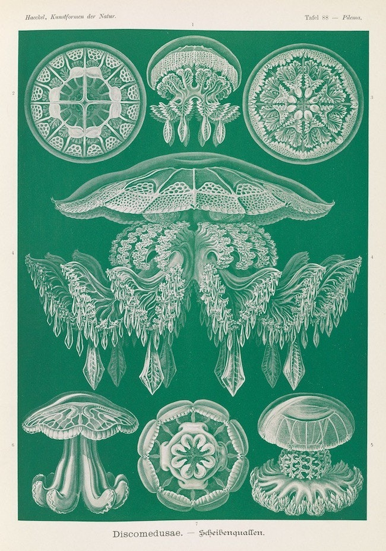

<html lang="en">
<head>
    <meta charset="UTF-8">
    <meta name="viewport" content="width=device-width, initial-scale=1.0">
    <title>Planktonic Way</title>
    
</head>

<body>
    
    

        <h1>Planktonic Way</h1>
        <nav>
            <a href="index.html">Home</a>
            <a href="about.html">About</a>
            <a href="contact.html">Contact</a>
    </nav>
    

        
    

    
        <article>
        
            <h2>Borders of the Mind, Borders of the Heart</h2>
            
Published on: Feburary 28, 2025

            
This photo was taken from an Uber going roughly 97 kph on my way back from Teotihuacan just North of Mexico City.

        </article>

        <article>
            <h2><a href="post2.html">Second Blog Post</a></h2>
            
Published on: January 30, 2025

            
This is a short preview of the second blog post...

        </article>

    

</body>
</html>
